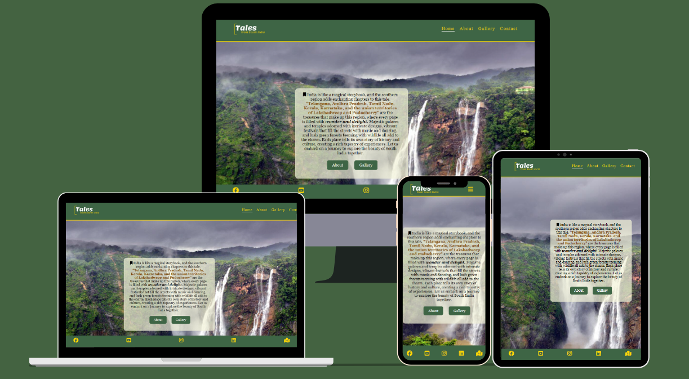
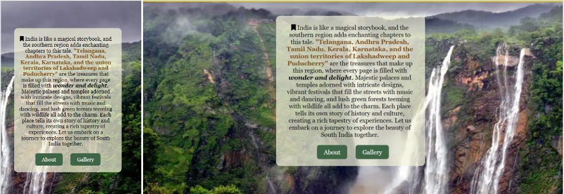
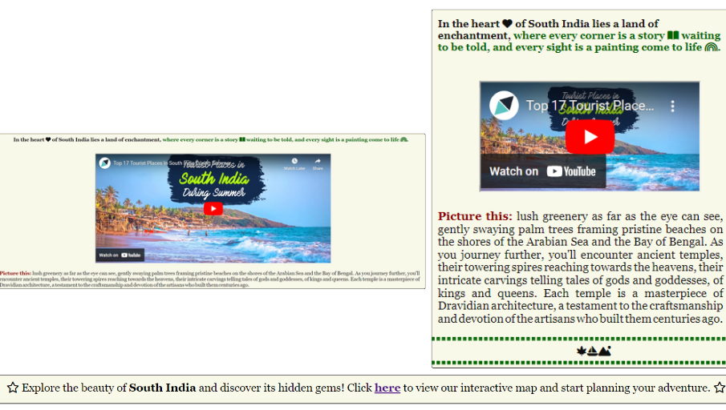
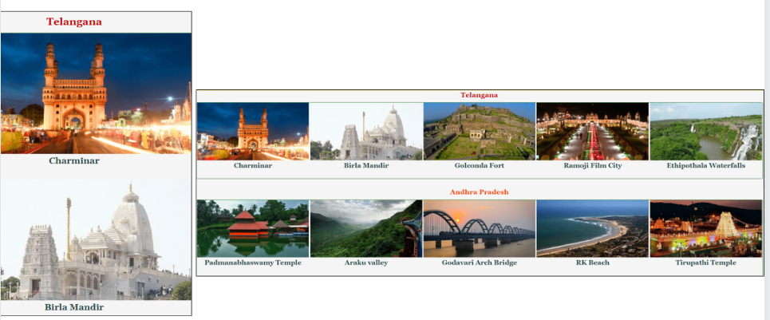
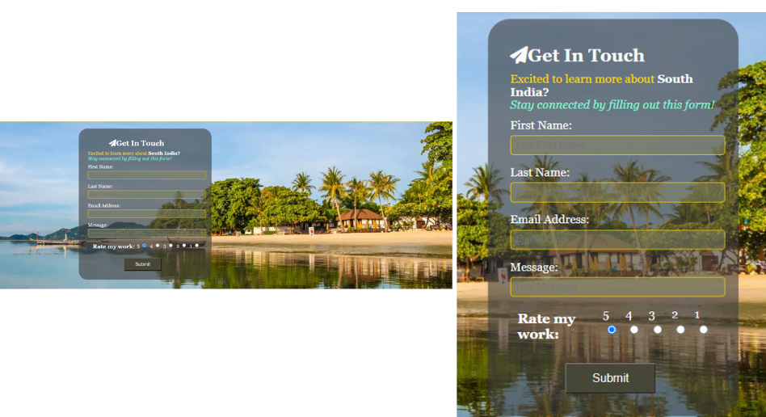
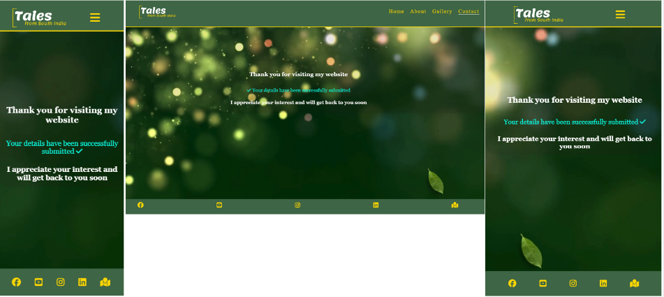
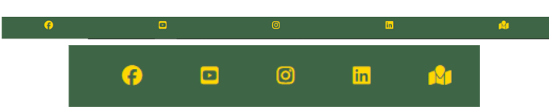
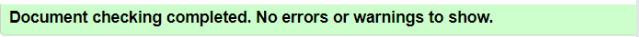
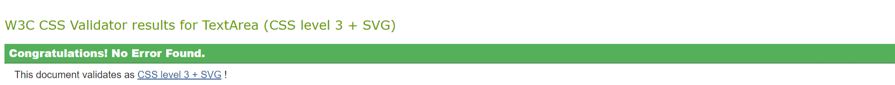

# Tales from South India

South India is in the southern region of India, known for its diverse landscapes, rich cultural heritage, and vibrant traditions. It comprises Kerala, Tamil Nadu, Karnataka, Telangana, and Andhra Pradesh states, along with the union territories of Puducherry and Lakshadweep, and offers a unique mix of history, spirituality, and natural beauty.

The beauty of the southern region of India is not just in its landscapes and architecture, but also in its people and their warm hospitality. The people of South India offers a truly unforgettable experience by making it a welcoming destination for travelers from around the world welcoming with open arms and treated to delicious cuisine.

- __Target Audience__

The tales-from-South-India website is for people who love to travel and want to explore unique experiences, history, culture, and nature in South India. It is to captivate individuals who appreciate storytelling that brings a destination to life, drawing them to explore the vibrant beauty of South India's landscapes, history, and culture through engaging narratives and insightful travel guides.

The purpose of this website is to showcase the unique culture, heritage, and tourist attractions of South India in an effective and informative way. View the live site [here](https://klsoundarya.github.io/Tales-from-South-India/).

GitHub Profile: <https://github.com/klsoundarya/Tales-from-South-India>
Deployed Site: <https://klsoundarya.github.io/Tales-from-South-India/>

## Table of contents

## Features

### Existing Features

- __Navigation__

  - The navigation features the logo image in the left side of the nav bar in all the four pages and other element links to the right of the nav bar.
  - The links include Home, About, Gallery, and Contact with hovering feature.
  - The user can experience hassle-free navigation on our website with the burger toggle icon for responsive media screens and,
  - Users can navigate through the four navigation elements - Home, About, Gallery, and Contact from page to page across all devices without having to press "back" button.

There are four media query breakpoints used: 425px, 768px, 992px, 1200px. This convenient feature allows users to easily access different sections of the website, making the browsing experience smoother and more efficient. User can Simply click on the burger icon to reveal the navigation menu and can also click the link of the pages, providing quick and intuitive access to all the important pages and sections of the website.

- __The landing page__

  - The landing page will be the first user interaction where it includes a hero banner that features a captivating image that draws users in.
  - This is accompained by a transparent background short text that provides a brief description of South India's highlights, enticing users to learn more.
  - The buttons below the text offers quick access to the About and Gallery pages, encouraging users to explore more content.

- __About page__

  - The goal is to paint a vivid and captivating portrait of South India States, inviting readers to immerse themselves in its beauty and culture firsthand.
  - Added a captivating visual video, to enhance the storytelling experience and give readers a glimpse of what South India has to offer.
  - Included an interactive clickable element like maps to further engage readers and help them plan their own adventures.
  - Added hover to the State names to make the states name highlighted.

- __Gallery page__

  - The page features stunning images of tourist destinations in South India, including Telangana, Andhra Pradesh, Tamil Nadu, Kerala, and Karnataka.
  - The images are neatly organized under each state, making it easy for visitors to browse through the different destinations.
  - Each image is accompanied by a name description, providing context and enhancing the viewer's experience.

- __Contact page__

  - The purpose of a contact page is to provide readers with a way to easily get in touch with the me.
  - It serves as a communication gateway, allowing readers to ask questions, provide feedback, report issues, or engage in further discussions related to the website.
  - The form is created by keeping user in mind by enhancing user experience by making it convenient for readers to reach out, ultimately fostering a stronger connection between the website and its audience.
  - The form includes clear labels for each input field, making it easy for users to understand what information is required.
  - The rating buttons allow users to easily rate my work, providing valuable feedback and suggestions.
  - The form prominently displays a "Submit" button, encouraging users to send their message or feedback easily.

- __Thank-You page__

  - Added a fullscreen video background that adds a dynamic and engaging element to the page, making it visually appealing.
  - The layout appears to be responsive, adjusting appropriately to different screen sizes for a consistent user experience.
  - The thank you message is clear and prominently displayed, letting users know that their submission was successful.

- __Footer__

  - Have included links to Facebook, YouTube, Instagram, and LinkedIn pages making it easy for visitors to connect on various social media platforms.
  - It also has a link to a map, that allows visitors to explore the locations talking about more easily.
  - The thank you message is clear and prominently displayed, letting users know that their submission was successful.

- __Features to Implement__

  - I will Integrate maps to showcase tourist spots, hotels, and transport availabilities.
  - Will add an calendar of local events and festivals for travelers to take an experience of cultural experience in south india.
  - Develop detailed travel guides for each state, covering attractions, culture, cuisine, and tips.
  - I will Expand the content with engaging blogs and articles sharing travel stories and tips.
  - Will add a dark mode toggle in the future to allow users to switch between a light and dark color scheme. This feature gives users the option to choose the mode that is more comfortable for them, especially in low-light environments or for those who prefer darker interfaces.

### Accessability

    - I have used semantic HTML elements like header, nav, main, body, footer, h1, p, strong, em, and a appropriately, which helps the readers to understand the technologies & structure of my content.
    - Added high contrast text against the background color in many places, which improves readability for users with visual impairments.
    - Provided descriptive alt & aria label attributes for images, which is essential for users who rely on screen readers to understand the content of the images.
    - Focus styles are applied to interactive elements like links and buttons, making it easier for keyboard users to navigate your site.
    - Used media queries and responsive design principles to ensure that website is accessible on a variety of devices, including mobile phones and tablets.

## Testing

- __Manual Testing__
  
  - Nav bar allows users to go to the expected section page
  - Map opens up in a new tab
  - Gallery page images load without delay
  - Embedded youtube video allow users to play as expected
  - Links in the footer takes user to the expected social media platform
  - Form submits without an error and receives a thank you note

- Tales from South India website is tested and verified with no issues in
  
  - Google Chrome
  - Mozilla Firefox
  - Microsoft Edge

- Tales from South India website is tested and verified in various screen devices by using Google chrome web developer tools
  
  - Laptop
  - Tablet
  - Large screen mobile
  - Galaxy Fold

### Validator Testing

All pages passed through the Lighthouse test

- [Lighthouse test for Home Page](readme-documents/testing-validators/Lighthouse-test-home-page.PNG)
- [Lighthouse test for About Page](readme-documents/testing-validators/Lighthouse-test-about-page.PNG)
- [Lighthouse test for Gallery Page](readme-documents/testing-validators/Lighthouse-test-gallery-page.PNG)
- [Lighthouse test for Contact Page](readme-documents/testing-validators/Lighthouse-test-contact-page.PNG)
- [Lighthouse test for thankyou Page](readme-documents/testing-validators/Lighthouse-test-thankyou-page.PNG)

- __HTML__

All pages have passed through the [W3 Markup HTML Validator](https://validator.w3.org/)

- 

- __CSS__

CSS stylesheet have passed through the [W3 CSS Validator](https://jigsaw.w3.org/css-validator/)

- 

### Wireframes

To adhere to best practices, I created wireframes for mobile, tablet, and desktop screen sizes.

I have used [Canva](https://www.canva.com/) to design my website wireframes.

### Mobile Wireframes

Phone Wireframes

### Laptop Wireframes

Laptop Wireframes

