# Tales from South India

South India is in the southern region of India, known for its diverse landscapes, rich cultural heritage, and vibrant traditions. It comprises Kerala, Tamil Nadu, Karnataka, Telangana, and Andhra Pradesh states, along with the union territories of Puducherry and Lakshadweep, and offers a unique mix of history, spirituality, and natural beauty.

The beauty of the southern region of India is not just in its landscapes and architecture, but also in its people and their warm hospitality. The people of South India offers a truly unforgettable experience by making it a welcoming destination for travelers from around the world welcoming with open arms and treated to delicious cuisine.

GitHub Profile: <https://github.com/klsoundarya/Tales-from-South-India>
Deployed Site: <https://klsoundarya.github.io/Tales-from-South-India/>

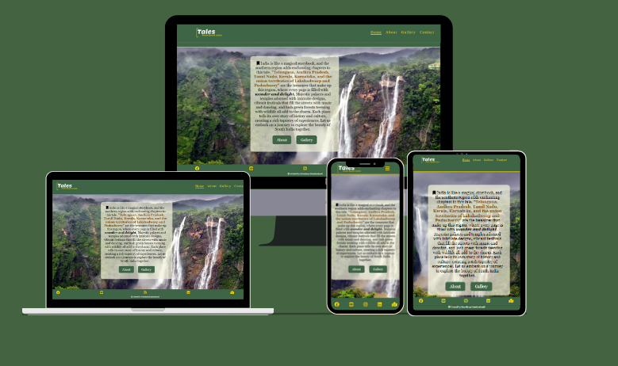

## Table of contents

- [User Stories](#user-stories)
  - [First Time User Goals](#first-time-user-goals)
  - [Returning Site Users](#returning-site-users)
  - [Site Owner Goals](#site-owner-goals)
  - [Target Audience](#target-audience)
- [Wireframes](#wireframes)
  - [Mobile Wireframes](#mobile-wireframes)
  - [Laptop & Desktop Wireframes](#laptop--desktop-wireframes)
- [Deployment](#deployment)
  - [GitHub Pages](#github-pages)
  - [Forking](#forking)
  - [Making a Local Clone](#making-a-local-clone)
- [Features](#features)
  - [Existing Features](#existing-features)
  - [Features to Implement](#features-to-implement)
- [Design](#design)
  - [UX](#ux)
  - [Typography](#typography)
  - [Gallery](#gallery)
  - [Color Scheme](#color-scheme)
- [Testing](#testing)
  - [Manual Testing](#manual-testing)
  - [Validator Testing](#validator-testing)
    - [HTML](#html)
    - [CSS](#css)
  - [Bugs](#bugs)
    - [Unfixed Bugs](#unfixed-bugs)
- [Credits](#credits)
  - [Tools & Technologies Used](#tools--technologies-used)
  - [Acknowledgments](#acknowledgements)
  - [Git Commit Mistakes](#git-commit-mistakes)
  - [Disclaimer](#disclaimer)

### User Stories
<!-- Read few README documents of previous batches to understand user stories and wrote accordingly -->

#### First time User Goals

- As a user, I want to learn about the culture, history, and tourist attractions of South India through the website.
- As a user, I want to plan a trip to South India, including finding information on tourist spots, accommodations, and local cuisine.
- As a user, I want to understand the format of the website and want to navigate the site easily.
- As a user, I want the website to be user friendly, and want to open the site in various screen devices.

#### Returning Site Users

- As a returning user, I want to explore new articles, stories, or updates after the last visit.
- As a returning user, I want to know information on travel tips, cultural insights, or updates on tourist attractions.
- As a returning user, I want to continue to learn about the culture, history, and attractions of South India.
- As a returning user, I want to engage with other users through comments, forums, or social media.

#### Site Owner Goals

- As a site owner, I want to Ensure all content is up-to-date and accurate, reflecting the latest information about South India's attractions, culture, and tourism.
- As a site owner, I want to clearly communicate the website's purpose and goals to visitors, emphasizing its role as a resource for exploring South India's beauty, culture, and history.
- As a site owner, I want the website to perform well, with fast loading times and efficient code, to enhance user satisfaction and engagement.
- As a site owner, I want the website to be accessible and functional across various devices and screen sizes, providing a seamless user experience for all visitors.
- As a site owner, I will regularly validate all the code to ensure compliance with web standards and best practices, reducing the risk of errors and improving overall site quality.
- As a site owner, I will proactively identify and address any bugs or issues that may arise, when maintaining the website's functionality and reliability for users.

### Target Audience

The tales-from-South-India website is for people who love to travel and want to explore unique experiences, history, culture, and nature in South India. It is to captivate individuals who appreciate storytelling that brings a destination to life, drawing them to explore the vibrant beauty of South India's landscapes, history, and culture through engaging narratives and insightful travel guides.

The purpose of this website is to showcase the unique culture, heritage, and tourist attractions of South India in an effective and informative way.

### Wireframes

I have used [Canva](https://www.canva.com/) to design my website wireframes for mobile, laptop and desktop screen sizes to see and work on my website designing.

### Mobile Wireframes
<!-- learnt the dropdown from https://dev.to/asyraf/how-to-add-dropdown-in-markdown-o78 -->

Mobile Wireframes

 

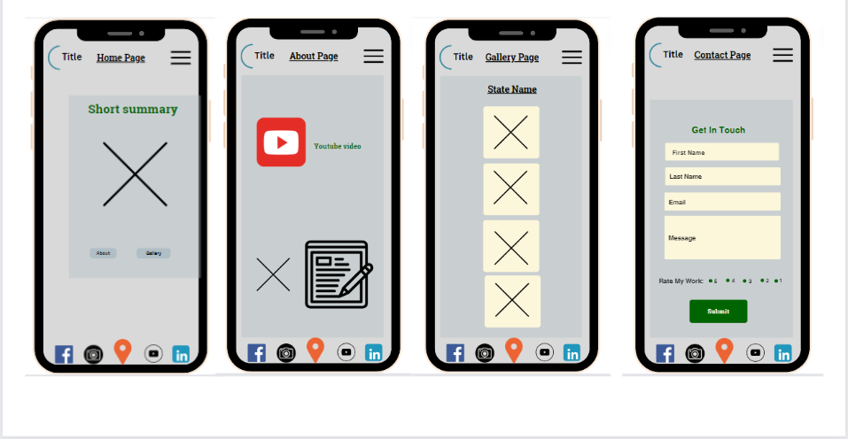

### Laptop & Desktop Wireframes

Laptop & Desktop Wireframes

 

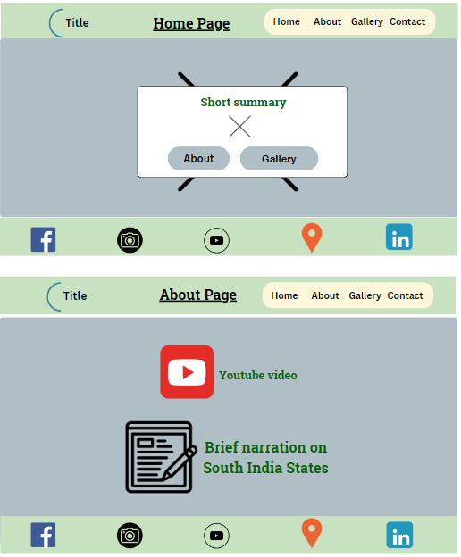
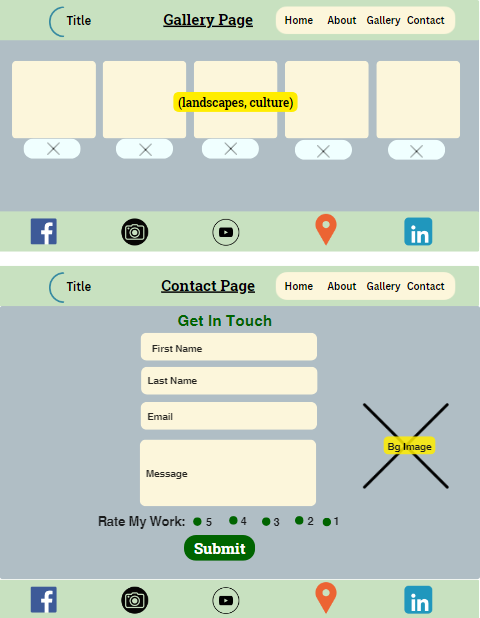

## Deployment

### GitHub Pages

The project was deployed to GitHub Pages using the following steps...

 

1. Log in to GitHub and locate [Tales-from-South-India Repository](https://github.com/klsoundarya/Tales-from-South-India)
2. At the top of the Repository, locate the "Settings" Button on the menu.
3. Scroll down to "GitHub Pages" Section in Settings page.
4. Under "Source", click the dropdown called "None" and select "Master Branch".
5. The page will automatically refresh.
6. Scroll back down through the page to locate the now published site [link](https://klsoundarya.github.io/Tales-from-South-India/) in the "GitHub Pages" section.

If using Gitpod, you can click below to create your own workspace using this repository.

#### Forking

By forking the GitHub Repository, we make a copy of the original repository on our GitHub account to view and/or make changes without affecting the original owner's repository.

You can fork this repository by using the following steps:

1. Log in to GitHub and locate the [Tales-from-South-India Repository](https://github.com/klsoundarya/Tales-from-South-India)
2. At the top of the Repository (not top of page) just above the "Settings" Button on the menu, locate the "Fork" Button.
3. Once clicked, you should now have a copy of the original repository in your own GitHub account!

### Making a Local Clone

1. Log in to GitHub and locate the [Tales-from-South-India Repository](https://github.com/klsoundarya/Tales-from-South-India)
2. Find the Code button situated above the file list and give it a click.
3. Choose your preferred cloning method — whether it's HTTPS, SSH, or GitHub and hit the copy button to copy the URL to your clipboard.
4. Launch Git Bash or Terminal.
5. Navigate to the directory where you want the cloned directory to reside.
6. In your IDE Terminal, input the following command to clone the repository:

> git clone <https://github.com/klsoundarya/Tales-from-South-India>

__Press Enter and your local clone will be created.__

## Features

Project Features

 

### Existing Features

- __Navigation__

  - The navigation features the logo image on the left side of the nav bar on all four pages and other element links to the right of the nav bar.
  - The links include Home, About, Gallery, and Contact with a hovering feature.
  - The user can experience hassle-free navigation on our website with the burger toggle icon for responsive media screens and,
  - Users can navigate through the four navigation elements - Home, About, Gallery, and Contact from page to page across all devices without having to press "back" button.

There are four media query breakpoints used: 425px, 768px, 992px, 1200px. This convenient feature allows users to easily access different sections of the website, making the browsing experience smoother and more efficient. Users can Simply click on the burger icon to reveal the navigation menu and can also click the link of the pages, providing quick and intuitive access to all the important pages and sections of the website.

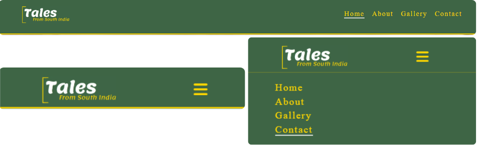

- __The landing page__

  - The landing page will be the first user interaction where it includes a hero banner that features a captivating image that draws users in.
  - This is accompanied by a transparent background short text that provides a brief description of South India's highlights, enticing users to learn more.
  - The buttons below the text offer quick access to the About and Gallery pages, encouraging users to explore more content.

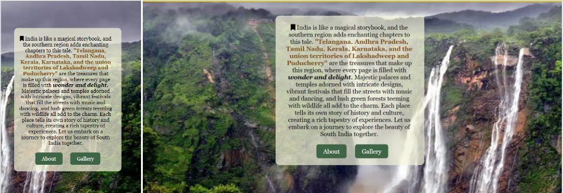

- __About page__

  - The goal is to paint a vivid and captivating portrait of South India States, inviting readers to immerse themselves in its beauty and culture firsthand.
  - Added a captivating visual video, to enhance the storytelling experience and give readers a glimpse of what South India has to offer.
  - Included an interactive clickable element like maps to further engage readers and help them plan their own adventures.
  - Added hover to the State names to make the state names highlighted.

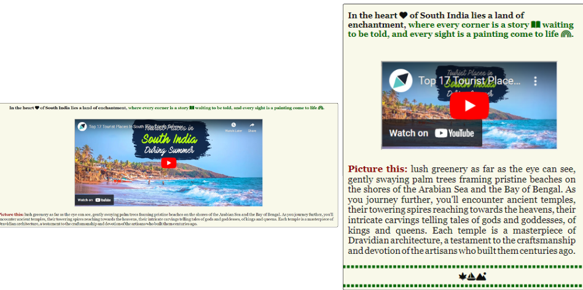

- __Gallery page__

  - The page features stunning images of tourist destinations in South India, including Telangana, Andhra Pradesh, Tamil Nadu, Kerala, and Karnataka.
  - The images are neatly organized under each state, making it easy for visitors to browse through the different destinations.
  - Each image is accompanied by a name description, providing context and enhancing the viewer's experience.

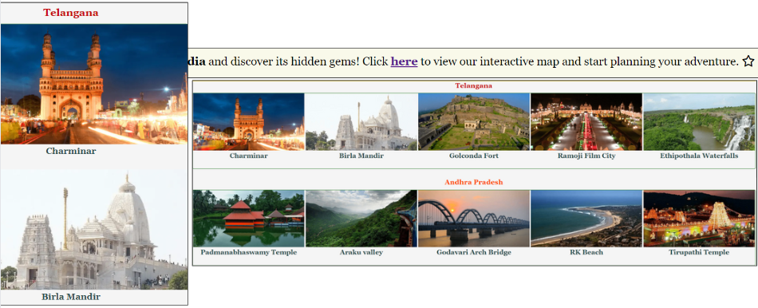

- __Contact page__

  - The purpose of a contact page is to provide readers with a way to easily get in touch with the me.
  - It serves as a communication gateway, allowing readers to ask questions, provide feedback, report issues, or engage in further discussions related to the website.
  - The form is created by keeping user in mind by enhancing user experience by making it convenient for readers to reach out, ultimately fostering a stronger connection between the website and its audience.
  - The form includes clear labels for each input field, making it easy for users to understand what information is required.
  - The rating buttons allow users to easily rate my work, providing valuable feedback and suggestions.
  - The form prominently displays a "Submit" button, encouraging users to send their message or feedback easily.

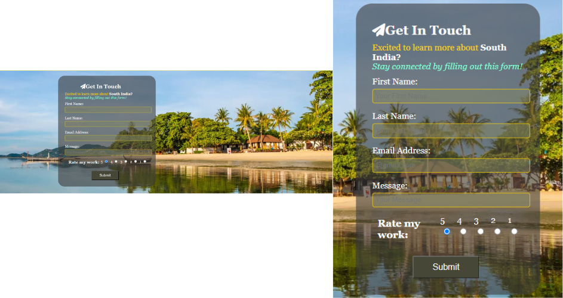

- __Thank-You page__

  - Added a fullscreen video background that adds a dynamic and engaging element to the page, making it visually appealing.
  - The layout appears to be responsive, adjusting appropriately to different screen sizes for a consistent user experience.
  - The thank you message is clear and prominently displayed, letting users know that their submission was successful.

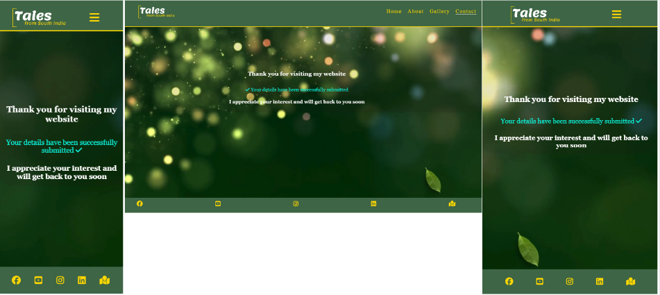

- __Footer__

  - Have included links to Facebook, YouTube, Instagram, and LinkedIn pages making it easy for visitors to connect on various social media platforms.
  - It also has a link to a map, that allows visitors to explore the locations talking about more easily.
  - The thank you message is clear and prominently displayed, letting users know that their submission was successful.

## Features to Implement

- I will Integrate maps to showcase tourist spots, hotels, and transport availabilities.
  - Will add an calendar of local events and festivals for travelers to take an experience of cultural experience in south india.
  - Develop detailed travel guides for each state, covering attractions, culture, cuisine, and tips.
  - I will Expand the content with engaging blogs, images and articles sharing travel stories and tips.
  - Will add a dark mode toggle in the future to allow users to switch between a light and dark color scheme. This feature gives users the option to choose the mode that is more comfortable for them, especially in low-light environments or for those who prefer darker interfaces.

  

### Design

## UX

User Experience

 

### Five Planes of User Experience

The five planes are like layers that designers think about when making things for people to use. It starts with big ideas and end with the actual look and feel of what users interact with.

#### The Strategy Plane

The strategy reason for my website is to create a platform that showcases the unique culture, heritage, and tourist attractions of South India. It aims to provide a valuable resource for travelers who want to explore the beauty and diversity of South India, offering them insights, tips, and information to plan their trips effectively. The website also seeks to engage with its audience through storytelling and interactive elements, fostering a sense of connection and community among those who share a love for travel and exploration.

#### The Scope Plane

Based on the Strategy Plane, the scope of my website includes the topics, regions, and aspects of South India that will be covered, as well as the specific features and functionalities that will be implemented, such as interactive maps, travel guides, and cultural insights. It helps ensure that the project stays focused and on track, avoiding unnecessary complexity or scope creep.

#### The Structure Plane

After the Scope Plane were decided then its time to create a structure for my website. It includes the layout of pages, navigation menus, and the overall of information. My website may have a homepage with a hero banner and buttons leading to other sections like About, Gallery, and Contact. Each of these sections would then have its own layout and content, creating a easy-to-navigate structure for users.

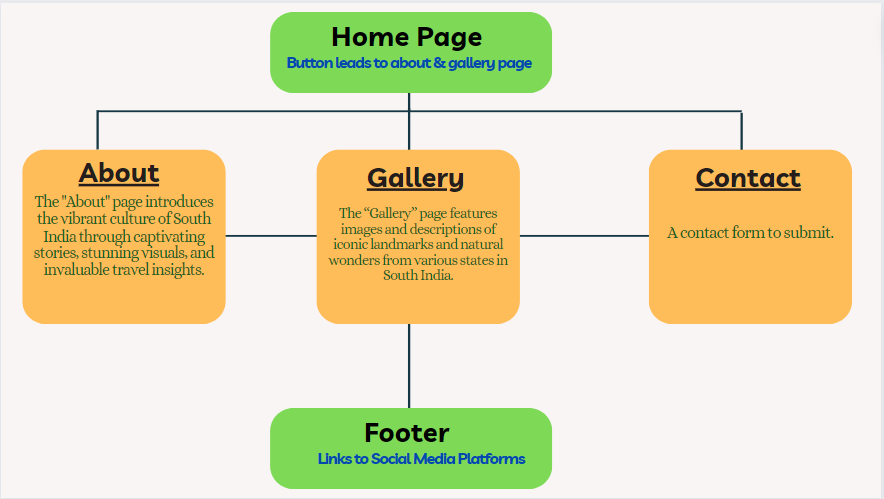

#### The Skeleton Plane

Please refer to the [Wireframes](#wireframes) section.

#### The Surface Plane

[View the live site here.](https://klsoundarya.github.io/Tales-from-South-India/)

Design Overview

 

#### Typography

The font used in the logo is Lemonada-It has a friendly and unique look, which can make the logo stand out, and for all headings the font is Oldenburg-It is decorative and adds a touch of elegance to the headings, making them more visually appealing. The font that is used in text is Georgia-It is a classic serif font that is easy to read, providing a comfortable reading experience for your website visitors. Used a fallback serif font to ensure that even if the custom fonts fail to load, the overall design and readability of the website are maintained.

#### Gallery
<!-- used shorten link to incorporate the Google link (https://tinyurl.com/app) -->
The images featured on the Home and gallery page is sourced from various websites and google images, [Tamilnadu Tourism](https://www.tamilnadutourism.tn.gov.in/destinations/pykara-ooty), [Travel Triangle](https://traveltriangle.com/blog/tourist-places-in-south-india-during-summer/), [Indian Holiday](https://www.indianholiday.com/blog/tourist-places-in-south-india/), and [Google](https://tinyurl.com/55mv3mfw).
The nav logo and background video for the Thankyou section page was sourced from [Canva](https://www.canva.com/).

#### Color Scheme

The color scheme chosen for this website consists of a harmonious color scheme that uses earthy tones like #3e6545 and accent colors like #ffd700 and #bece0c, creating a warm and inviting visual experience.

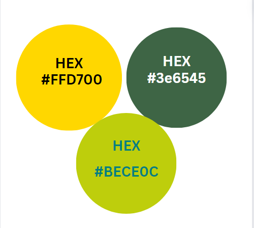

## Testing

### Manual Testing

<!-- Created Table from Table generator -->

User Testing

 

| Page     | Action                                                                                | Expected Behavior                                                              | Pass/Fail  |
|--------- |-------------------------------------------------------------------------------------- |------------------------------------------------------------------------------- |----------- |
| Home     | 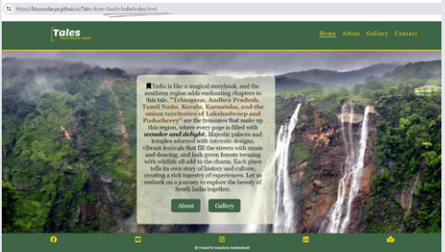           | After conducting manual testing, it has been verified that the home page displays a banner with a short text and two buttons for "About" and "Gallery." These buttons correctly link to the respective pages (about.html and `gallery.html) and open them when clicked. The layout, styling, and content of the banner are as expected, providing a positive user experience. | Pass       |
| About    | 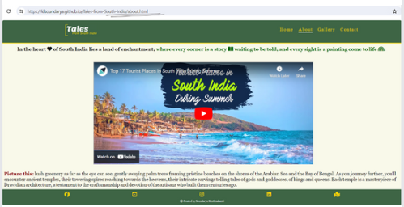           | When a user clicks on the "About" button from index page or from nav bar section, it will be directed to the "about.html" page, where it contains information about the tourists places to see in South India and a map that links all the states. The page functions correctly and it will provide a seamless user experience across different devices and browsers. | Pass       |
| Gallery  | 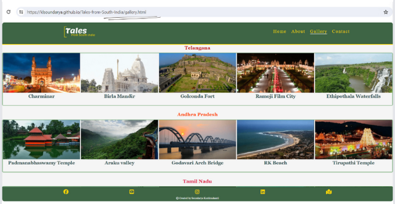       | Similarly, when a user clicks on the "Gallery" button, it will be directed to the "gallery.html" page, which showcases a collection of images related to South India. The page functions correctly as expected| Pass       |
| Contact  | 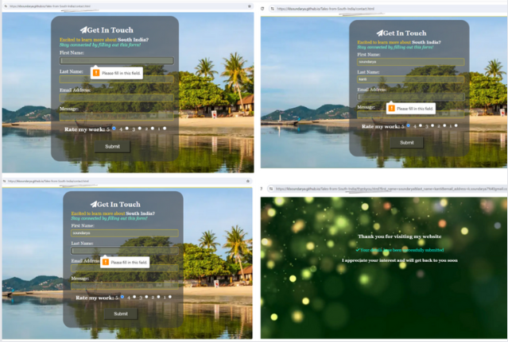  | The contact page contains a form that requires users to fill in their first name, last name, and email address. These fields are mandatory, and the form cannot be submitted unless they are filled. After submission, users are redirected to a thank you page, and all input areas work smoothly. | Pass       |
| Footer   | 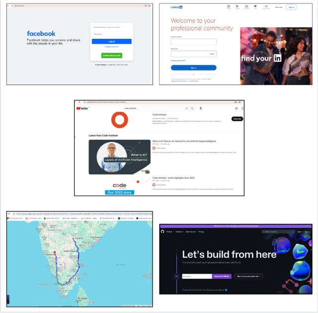                       | When a user clicks on any of the social media icons (Facebook, Github, LinkedIn, YouTube or the map icon), each link opens in a new tab and functions correctly, providing users with seamless access to the respective platforms.  | Pass       |

- Tales from South India website is tested and verified with no issues in different browsers:
  
  - [Google Chrome](https://www.google.com/intl/en_in/chrome/)
  - [Mozilla Firefox](https://www.mozilla.org/en-US/firefox/)
  - [Microsoft Edge](https://www.microsoft.com/en-us/edge/welcome?form=MA13FJ)

- Tales from South India website is tested and verified that my website is responsive in various screen devices by using Google chrome web developer tools
  
  - Laptop
  - Tablet
  - Large screen mobile
  - Galaxy Fold

### Validator Testing

All pages passed through the Lighthouse test

- [Lighthouse test for Home Page](readme/testing-validators/lighthouse-test-home-page.PNG)
- [Lighthouse test for About Page](readme/testing-validators/lighthouse-test-about-page.PNG)
- [Lighthouse test for Gallery Page](readme/testing-validators/lighthouse-test-gallery-page.PNG)
- [Lighthouse test for Contact Page](readme/testing-validators/lighthouse-test-contact-page.PNG)
- [Lighthouse test for thankyou Page](readme/testing-validators/lighthouse-test-thankyou-page.PNG)

### HTML

All pages have passed through the [W3 Markup HTML Validator](https://validator.w3.org/)

- 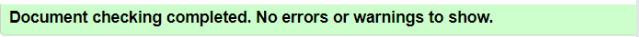

### CSS

CSS stylesheet have passed through the [W3 CSS Validator](https://jigsaw.w3.org/css-validator/)

- 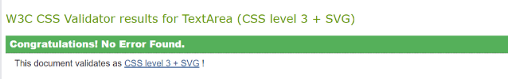

### Bugs

Bugs Fixed

 

| No.  | Bugs                                                                         | Solution                                                                                                                                                                                                                                               | Notes          |
|----- |----------------------------------------------------------------------------- |------------------------------------------------------------------------------------------------------------------------------------------------------------------------------------------------------------------------------------------------------- |--------------- |
| 1    |                       | The burger icon should properly be aligned with the logo in nav, but it is postioned wrongly. I I have adjusted the toggle by applying margins and padding to ensure they are evenly aligned with the logo.                                            | Fixed the Bug  |
| 2    | 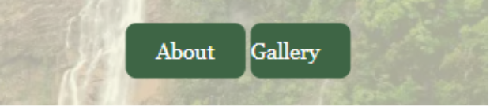                      | The buttons in the homepage text were too close to each other, which shouldn't be. I I adjusted them by using display: inline-block and also by applying margins and padding to ensure they are evenly distributed within the transparent background.  | Fixed the Bug  |
| 3    | 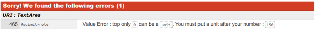                              | The number should have a unit after it. I have entered the unit px after the number.                                                                                                                                                                   | Fixed the Bug  |
| 4    | 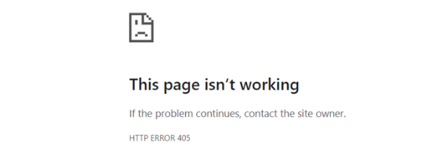  | After form submission, it should redirect to the thank you message page, but it was showing a 405 error. I fixed the bug by removing the POST method that i added and setting the action file to thankyou.html.                                                     | Fixed the Bug  |
| 5    | 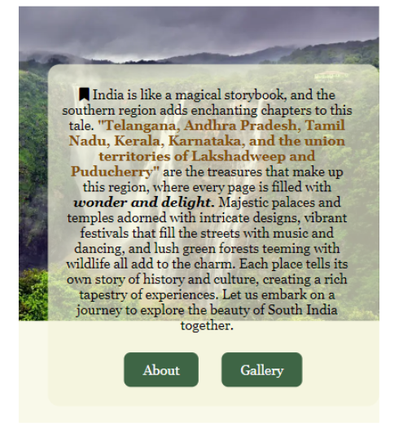                     | The banner image and the transparent is out of the place. I have fixed this bug by keeping height as 100vh and gave padding and margin to keep the tranparent text image to the centre.                 | Fixed the Bug  |
| 6    | 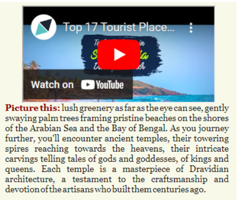              | The video border and the text content below it were too close together, lacking a gap between them. I resolved this issue by adding a specific value to the padding and margin.                                                                        | Fixed the Bug  |
| 7   |  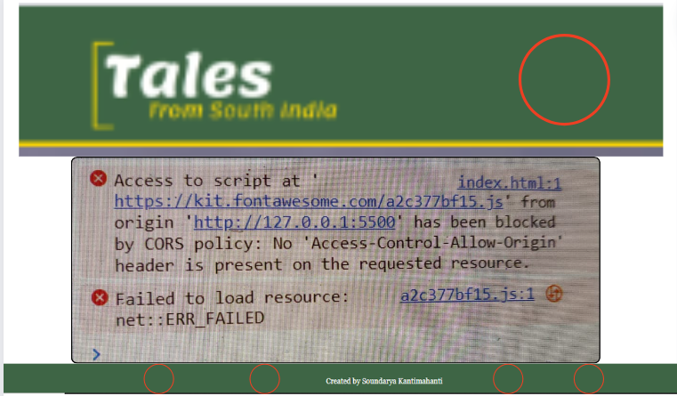   | Despite attempting various troubleshooting methods, the problem persists. I even switched to a new Font Awesome kit to address the CORS error, the issue persisted even when the kit was downloaded and hosted locally. Attempts to resolve the error using a CORS extension were unsuccessful. However, the server eventually resolved the issue on its own, and the icons began displaying correctly.  | partial pass  |

### Unfixed Bugs

There are no more bugs to be fixed.

## Credits

### Tools & Technologies Used

The following technologies were used in this overall project.

- I have used semantic [HTML](https://en.wikipedia.org/wiki/HTML5) elements like <header>, <nav>, <main>, <body>, <footer>, <h1>, 
, <strong>, <em>, and <a> appropriately, which helps the readers to understand the technologies & structure of my content.
- Added high contrast text against the background color in many places, which improves readability for users with visual impairments.
- Provided descriptive alt & aria label attributes for images, which is essential for users who rely on screen readers to understand the content of the images.
- Focus [CSS](https://en.wikipedia.org/wiki/CSS) styles are applied to interactive elements like links and buttons, making it easier for keyboard users to navigate your site.
- Used media queries and responsive design principles to ensure that website is accessible on a variety of devices, including mobile phones and tablets.
- [Favicon.io](https://favicon.io/favicon-converter/) is used to create the various favicon files for my website.
- [Font Awesome](https://fontawesome.com/) icons were used throughout my project.
- Used [TinyPNG](https://tinypng.com/) to compress images and convert them to .webp.
- [cloud convert](https://cloudconvert.com/png-to-webp) was used to for the gallery images to convert from PNG to webp.
- I utilized Font Joy and Google Fonts for font pairing and to visualize the look and feel of my website.
- [ChatGPT](https://chat.openai.com/), [Grammarly](https://app.grammarly.com/), and a [plagiarism checker](https://www.duplichecker.com/) is used to review the text and ensure there were no grammar or spelling mistakes.
- [Learn UI Design](https://www.learnui.design/tools/accessible-color-generator.html) was used to identify primary colours, compliment and contrast color combination for the website's design.
- I used [Canva](https://www.canva.com/) to create the navigation logo, graphics used in readme, favicon image, "Am I Responsive" design, wireframes, and background video for the Thank You section page. Additionally, I used it to resize all images to a consistent size.
- [wikipedia](https://en.wikipedia.org/wiki/South_India) is used for content research.
- I referred to resources such as [MDN](https://developer.mozilla.org/en-US/), [stack overflow](https://stackoverflow.com/), [W3Schools](https://www.w3schools.com/css/default.asp) for assistance in understanding code in few places and finding answers to questions relevant to my website.
- I used [TravelTriangle](https://www.youtube.com/watch?v=JY4UzICqo5U) video to my about page.
- [google maps](https://www.google.com/maps) is used in the footer to show the travellers about the south indian states.
- [Visual Studio Code](https://code.visualstudio.com/) used as a remote code editor.
- [Gitpod](https://gitpod.io) used as a cloud-based IDE for development.
- [GitHub](https://github.com) used for secure online code storage.
- [GitHub Pages](https://pages.github.com) used for hosting the deployed front-end site.
- [Git](https://git-scm.com/) was used for version control by utilizing the command line terminal in VS code and GitPod to commit and Push to GitHub.
- My project is inspired from [code institute](https://learn.codeinstitute.net/) Love Running Walkthrough Project.

### Acknowledgements

- I want to express my gratitude to several individuals and groups who supported me throughout this project, My Code Institute mentor, [Dick Vlaanderen](https://github.com/dickvla), for his invaluable support, encouragement, and feedback throughout this project.
- I would like to thank my Cohort Facilitator, [Amy](https://github.com/amylour), for her guidance, providing us with the relevant learning materials, and steering our team in the right direction that kept me going forward without having a self doubt and
- The [Code Institute](https://codeinstitute.net) tutor team for their prompt responses and assistance in resolving GitPod issues.
- I personally want to thank my partner, family and my two friends for unwavering support, belief, and feedback, which helped me transition into software development. They also helped me by conducting user testing and providing me with their feedback so that I can fix the bugs and improve my website.

### Git Commit Mistakes

After receiving guidance from my mentor [Dick Vlaanderen](https://github.com/dickvla) during a recent call, I have implemented improvements in the way I compose Git commit messages. Previously, I had inadvertently made spelling errors and used incorrect syntax in my messages. However, following our discussion, I have begun adhering to proper conventions for Git commit messages. This adjustment not only enhances the clarity and professionalism of my contributions but also ensures consistency within our collaborative development environment.

### Disclaimer

> I created a feature branch  within the main branch specifically to address the broken image links in the README file and in contact page background image. Since these issues were impacting the functionality of my main branch project, I decided to isolate the changes in a separate branch named 'feature'. After fixing the bugs and ensuring the stability of the changes, I merged the feature branch into the main branch.
