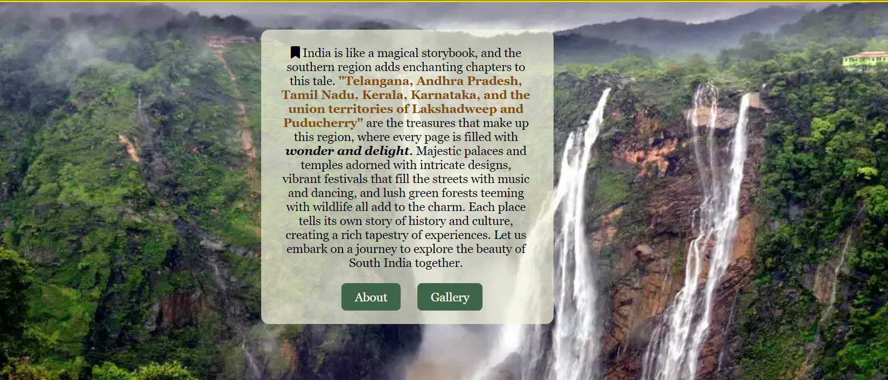
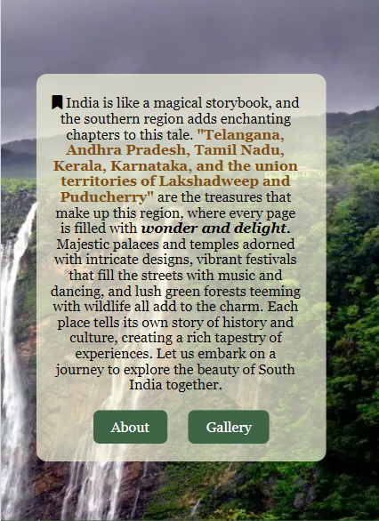
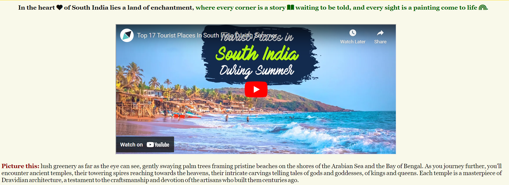
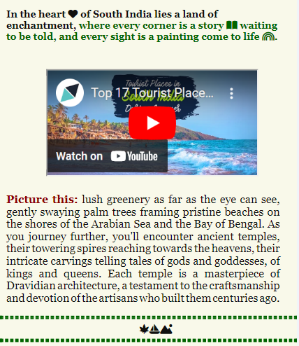

# Tales from South India

South India is in the southern region of India, known for its diverse landscapes, rich cultural heritage, and vibrant traditions. It comprises Kerala, Tamil Nadu, Karnataka, Telangana, and Andhra Pradesh states, along with the union territories of Puducherry and Lakshadweep, and offers a unique mix of history, spirituality, and natural beauty.

The beauty of the southern region of India is not just in its landscapes and architecture, but also in its people and their warm hospitality. The people of South India offers a truly unforgettable experience by making it a welcoming destination for travelers from around the world welcoming with open arms and treated to delicious cuisine.

-__Target Audience__

The tales-from-South-India website is for people who love to travel and want to explore unique experiences, history, culture, and nature in South India. It is to captivate individuals who appreciate storytelling that brings a destination to life, drawing them to explore the vibrant beauty of South India's landscapes, history, and culture through engaging narratives and insightful travel guides.

The purpose of this website is to showcase the unique culture, heritage, and attractions of South India in an effective and informative way. View the live site [here](https://klsoundarya.github.io/Tales-from-South-India/).

GitHub Profile: <https://github.com/klsoundarya/Tales-from-South-India>
Deployed Site: <https://klsoundarya.github.io/Tales-from-South-India/>

## Table of contents

## Features

### Existing Features

- __Navigation__

- The navigation features the logo image in the left side of the nav bar in all the four pages and other element links to the right of the nav bar.
- The links include Home, About, Gallery, and Contact.
- The user can experience hassle-free navigation on our website with the burger toggle icon for responsive media screens and,
- Users can navigate through the four navigation elements - Home, About, Gallery, and Contact from page to page across all devices without having to press "back" button.

There are four media query breakpoints used: 425px, 768px, 992px, 1200px. This convenient feature allows users to easily access different sections of the website, making the browsing experience smoother and more efficient. User can Simply click on the burger icon to reveal the navigation menu and can also click the link of the pages, providing quick and intuitive access to all the important pages and sections of the website.

- __The landing page__

- The landing page includes a hero banner that features a captivating image that draws users in.
- The short text provides a brief description of South India's highlights, enticing users to learn more.
- The buttons below the short text offer quick access to the About and Gallery pages, encouraging users to explore more content.

- __About page__

- The goal is to paint a vivid and captivating portrait of South India, inviting readers to immerse themselves in its beauty and culture firsthand.
- Added a captivating visual video, to enhance the storytelling experience and give readers a glimpse of what South India has to offer.
- Included an interactive clickable elements like maps to further engage readers and help them plan their own adventures.

